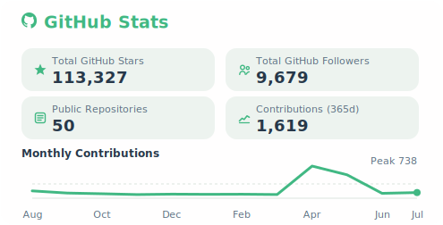
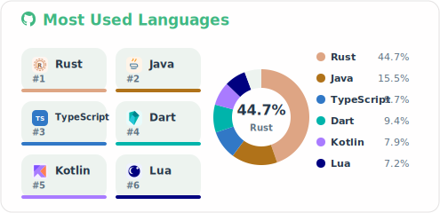
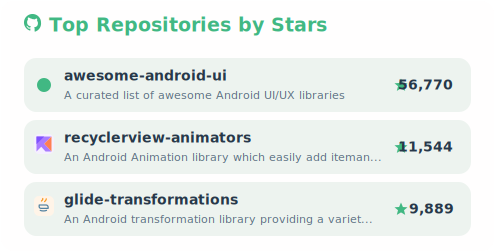
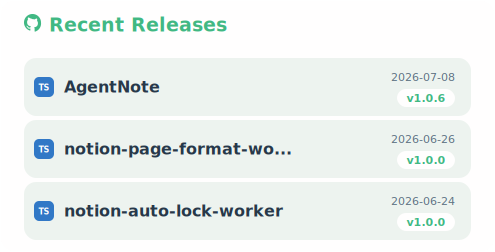

### Hi 
 

I'm [Daichi Furiya](https://twitter.com/wasabeef_jp), a **[Google Developers Expert for Android](https://developers.google.com/community/experts/directory/profile/profile-daichi-furiya)** 👨🏻‍💻 aspiring to become an Expert in the field of **Mobile** development. I’m also an **Open-Source** enthusiast with all of my projects open-sourced on [Github](https://github.com/wasabeef?tab=repositories).
 
 

- 🗼 Living in **Tokyo, Japan**

- 👨‍💻 Currently Working at CyberAgent

- 👍 Dogs and Gaming 🐶 🎮

- ✈️ Open to Remote Job Opportunities 🍻

 

### 📈 GitHub Stats

  
  

  
  

### ♡ Top Sponsors

- [Become a sponsor](https://github.com/sponsors/wasabeef)
